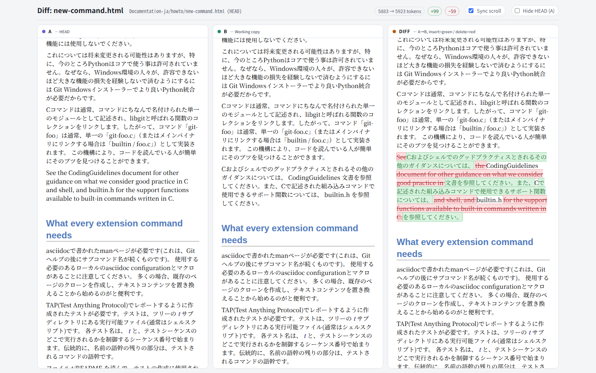

# git-diff-html

A `git` subcommand that renders an HTML file's content at a given revision
(default: `HEAD`) side by side with the working tree's version in your web
browser — plus a third pane with a word-level diff (insertions in green,
deletions in red). Display only; nothing can be edited from the generated
page.

It was originally built as an Emacs/magit command (`magit-last-html-diff`)
for reviewing translation work in the `git-docs-ja` project, then rewritten
as a standalone `git` + `bash` subcommand with no Emacs dependency, and
later split out into this repository so it can be used on its own.



## Features

- Three-pane view: revision (A) / working copy (B) / word-level diff
- Diff is tokenized by HTML tag, whitespace, single CJK character, or
  alphanumeric word, and highlighted accordingly (Myers diff algorithm)
- Synchronized scrolling across panes (percentage-based, like
  `scroll-all-mode`)
- `<path>` is resolved like any git pathspec — relative to the current
  directory, so it also works from a subdirectory
- No server, no build step: a single self-contained HTML file (data
  base64-embedded) is generated per run and opened via `xdg-open`

## Requirements

- `git`, `bash`, `base64`
- `xdg-open` (or an equivalent available on your `$PATH`) to open the
  generated file in a browser
- A web browser with JavaScript enabled

## Installation

```sh
git clone <this-repo-url>
cd git-diff-html
./install-git-diff-html.sh
```

This copies the files as follows:

| Source                    | Destination                              |
|----------------------------|------------------------------------------|
| `git-diff-html.sh`         | `~/bin/git-diff-html`                    |
| `diff-html-template.html`  | `~/share/diff-html/diff-html-template.html` |
| `git-diff-html.1`          | `~/share/man/man1/git-diff-html.1`       |
| `git-diff-html.ja.1`       | `~/share/man/ja/man1/git-diff-html.1`    |

Make sure `~/bin` is on your `$PATH` and (optionally) `~/share/man` is on
your `$MANPATH`. Once installed, it can be run either as a standalone
command or as a `git` subcommand:

```sh
git-diff-html [<revision>] [--] <path>
git diff-html  [<revision>] [--] <path>
```

## Usage

```
git diff-html [<revision>] [--] <path>
git diff-html --cleanup | -C
```

- `<revision>` — defaults to `HEAD`. A full 40/64-character hash is
  shortened for display via `git rev-parse --short`.
- `<path>` — resolved like any ordinary git pathspec, relative to the
  current directory (works from a subdirectory too).
- `--cleanup` / `-C` — removes every generated temporary file
  (`${TMPDIR:-/tmp}/git-diff-html-*.html`) instead of comparing anything.
  Prints nothing when there is nothing to remove.

### Examples

```sh
# Compare HEAD's version against the working copy
git diff-html -- path/to/file.html

# Compare the version from 3 commits ago against the working copy
git diff-html HEAD~3 -- path/to/file.html

# Remove leftover generated temporary files
git diff-html --cleanup
```

See `man git-diff-html` (English, or Japanese automatically under a
Japanese locale) for the full manual page.

## License

[MIT](LICENSE)
